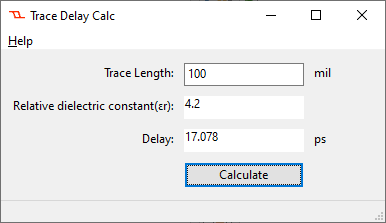
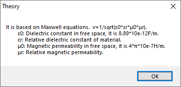

# TraceDelayNim

TraceDelayNim is a very simple PCB transmission line delay calculator rewrite from my previous python version to [nim](https://nim-lang.org)

The  GUI library is [wNim](https://github.com/khchen/wNim), which calls native windows API to make the target exe file very small size.

The nim lang seems even more  succinct than python, while it is compiled by gcc in my case.

This is just a learning porotype, the calculator is very simple, which could be done by more easier tools like excel.

